 ### 使用Java语言作为后端对接 chatgpt，使用简单，并且有可以免费chatgpt3.5,没有套路
 ### 后端架构：mysql,springBoot 部署简单维护也简单
 ###蓝猫AI后端服务指引
### 效果可以体验 ： http://www.chosen1.xyz/
### 对应蓝猫ai前端地址： https://gitee.com/lixinjiuhao/chatgpt-web-java
### 管理后台前端地址（共用一个后端服务）：https://gitee.com/Linyous/blue-cat-commercial-admin-ui
 ### 如果没有合适的代理地址可以走我这边的代理，免费
 #### 步骤1：
    在蓝猫AI http://www.chosen1.xyz/ 注册账号
 #### 步骤2： 获取系统的token
 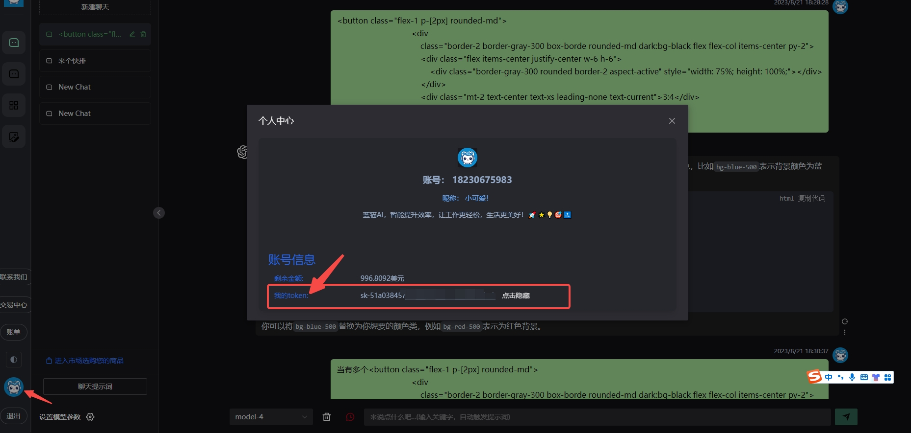
 
  #### 步骤3： 设置代理地址和token
    国内环境中：http://www.chosen1.xyz/ + token(蓝猫AI系统中的token)
    海外环境走：https://www.liulinlin.top + token(蓝猫AI系统中的token)
    调用方式和原生的gpt的api调用是一样的，目前蓝猫AI支持全模型的调用（gpt-3.5 gpt-4 gpt-4-32k）
    如果需要购买gpt额度，可以找蓝猫AI的管理员，价格价（具体参考蓝猫AI系统的定价）如下：
    1美元 = 2.5元 额度买的多越便宜
    目前开源数据库中走的是蓝猫账号：18230600006 的token ，希望大家不要过度使用 
 
## 后端定制化返回markdowm格式给前端进行图片展示：

## 功能
1. 支持多种大模型：
   + [x] [OpenAI ChatGPT 系列模型](https://platform.openai.com/docs/guides/gpt/chat-completions-api)（支持 [Azure OpenAI API](https://learn.microsoft.com/en-us/azure/ai-services/openai/reference)）
   + [x] [midjourney](https://bigmodel.cn)
2. 支持配置镜像以及众多第三方代理服务：
   + [x] [OpenAI-SB](https://openai-sb.com)
   + [x] [API2D](https://api2d.com/r/197971)
   + [x] [OhMyGPT](https://aigptx.top?aff=uFpUl2Kf)
   + [x] [CloseAI](https://console.closeai-asia.com/r/2412)
   + [x] 自定义渠道：例如各种未收录的第三方代理服务
3. 支持通过**权重算法负载均衡**的方式访问多个渠道。
4. 支持 **stream 模式**，可以通过流式传输实现打字机效果。
5. 支持**兑换码管理**，支持批量生成和导出兑换码，可使用兑换码为账户进行充值。
6. 支持**通道管理**
7. 支持**渠道**
8. 支持渠道**设置模型列表**。
9. 支持**查看额度明细**。
10. 支持**查看用户额度消费快照**。
11. 支持以美元为单位显示额度。
12. 支持失败自动重试。
13. 支持绘图接口。
14. 支持通过系统访问令牌访问管理 API。

## 上效果图
### pc聊天效果图
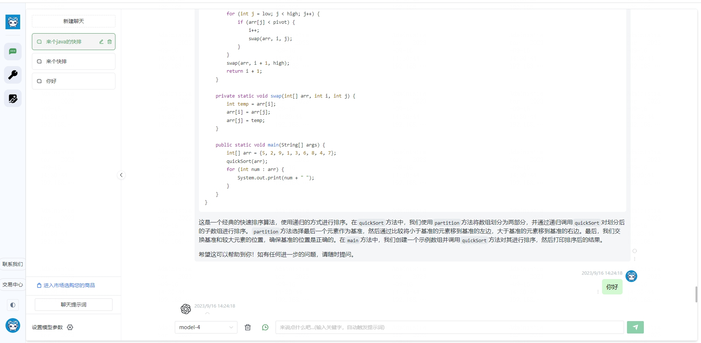
### 手机端聊天效果图
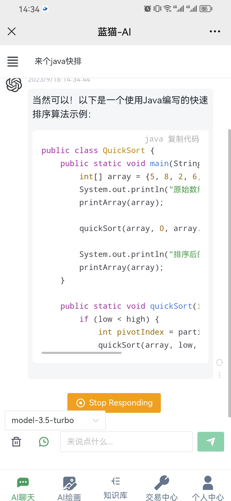
### 绘画效果图
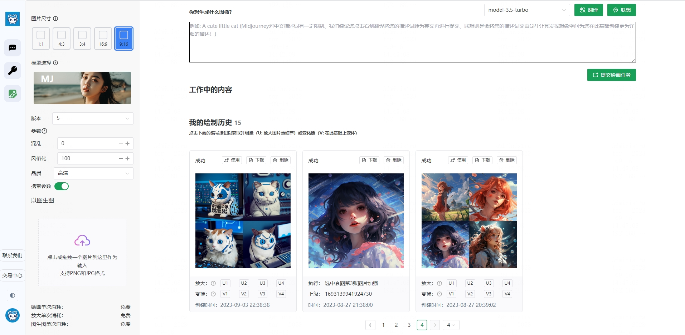
### 后端管理首页
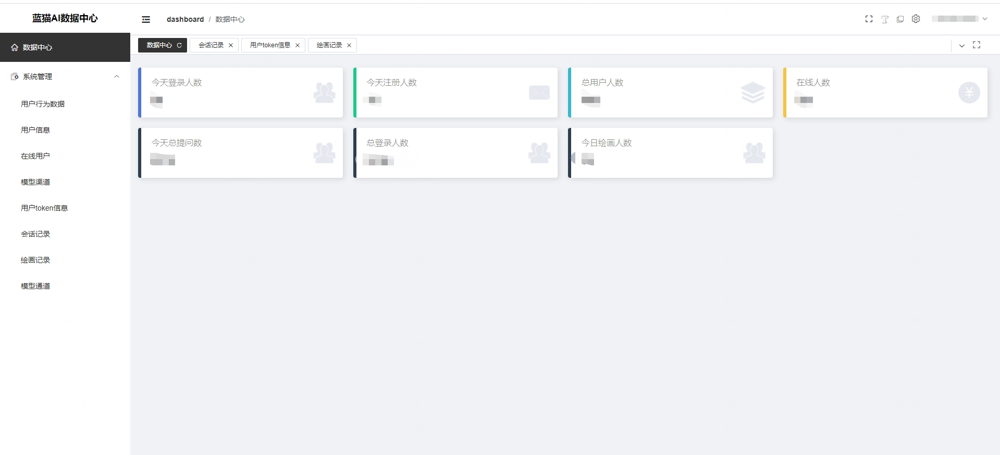
### 渠道管理
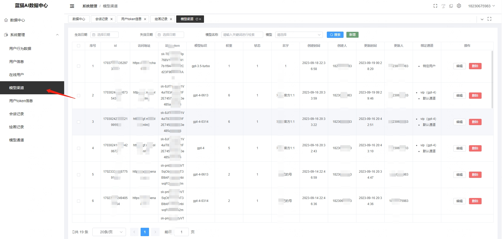
### 通道管理
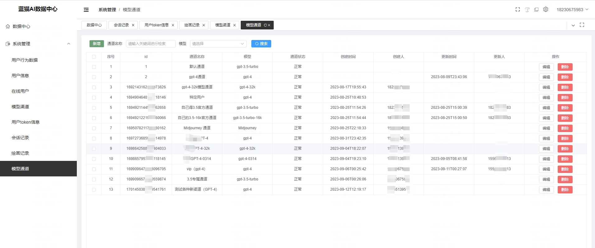

## 项目启动准备
### 本地或者线上环境的 mysql连接信息
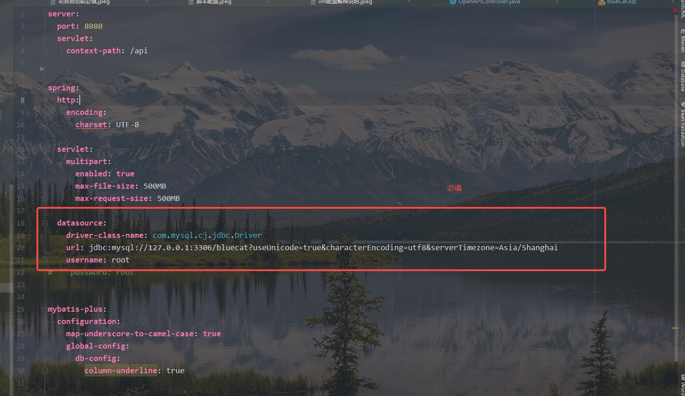
2023-08-10开启由数据库表管理 gpt配置，具体如下图，支持各种中转站的key
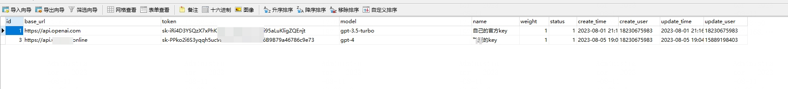
### 本地根据vm指令去加载不同环境的配置
#### 步骤一
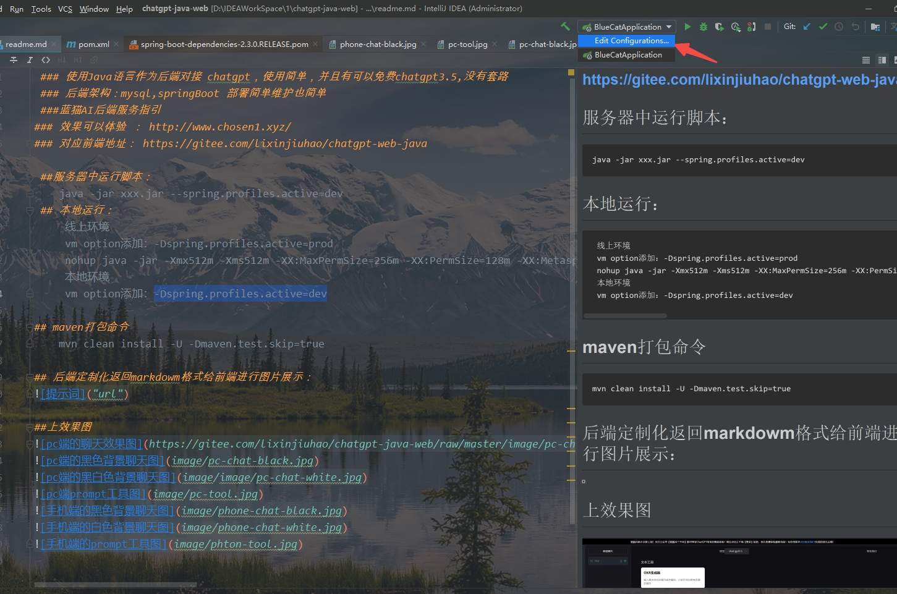
#### 步骤二
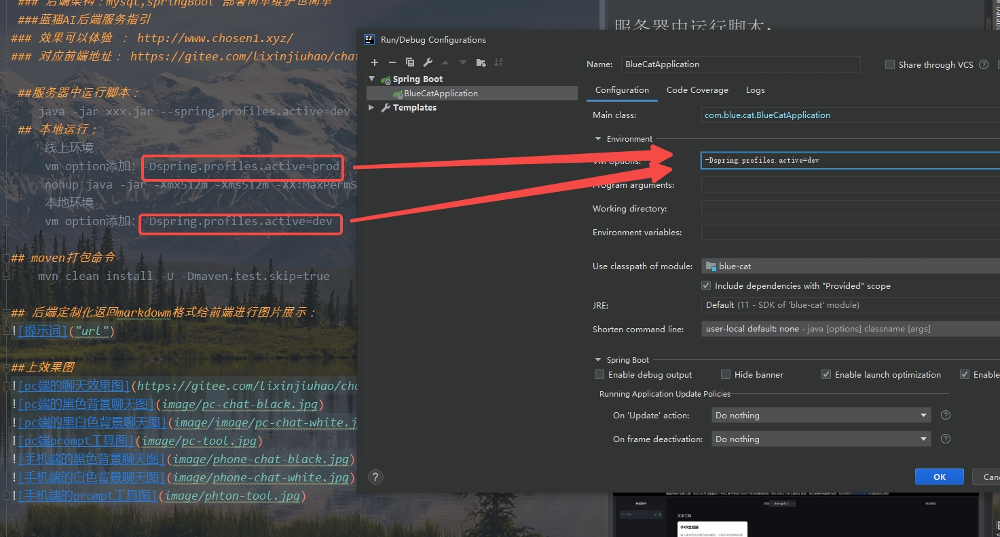
解释说明
按照上面操作：
vm options添加： -Dspring.profiles.active=dev 则代表 加载 application-dev.yml 配置
vm options添加： -Dspring.profiles.active=prod 则代表 加载 application-prod.yml 配置
对应下图的
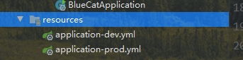

# 项目部署 方式1：
 ##服务器中运行脚本： 
    java -jar xxx.jar --spring.profiles.active=dev
 ## 本地运行：
     线上环境
     vm option添加：-Dspring.profiles.active=prod
     nohup java -jar -Xmx512m -Xms512m -XX:MaxPermSize=256m -XX:PermSize=128m -XX:MetaspaceSize=256M  -XX:MaxMetaspaceSize=256M  -XX:+UseParallelGC -XX:+PrintGCDetails -XX:+PrintGCDateStamps -Xloggc:/var/log/myapp/gc.log  blue-cat-0.0.8-SNAPSHOT.jar --spring.profiles.active=prod 
     本地环境
     vm option添加：-Dspring.profiles.active=dev

## maven打包命令
    mvn clean install -U -Dmaven.test.skip=true

# 项目部署部署 方式2
## 通过脚本一键部署 
### 步骤一：
    前提： 需要在服务器安装 git , maven ， jdk  
    脚本做了以下几件事：
    1. 从git拷贝项目（这个步骤最好是手动执行，因为一般来说git需要登录，可以使用下面的命令来记录git账号密码）
    git config --global credential.helper store
    2. 拷贝完项目之后将会在项目的根目录下 执行：git pull
    3. 然后开始使用maven打包项目
    4. 通过jdk启动打包好的jar
### 步骤二：
    打开目标脚本： bin/server.sh  ，按照你自己的配置进行改动脚本里面的自定义脚本配置
   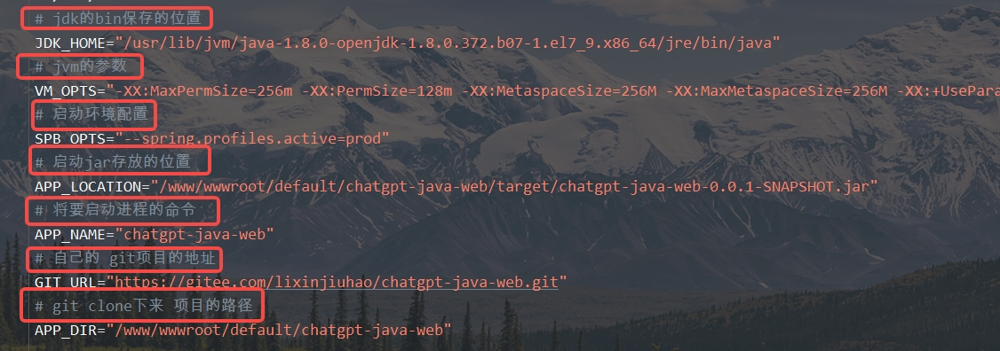
### 步骤三：
    拷贝server.sh 到项目所需要保存的位置
    执行sh server.sh start // 启动命令 
    执行sh server.sh restart //重启项目
    执行sh server.sh stop // 停止项目 
   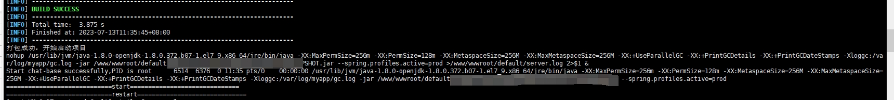

   
# 疑问
    如果还有什么不清晰的，可以提 issues  ，希望大家点点 star
    欢迎大家一起维护蓝猫AI，此项目代码全部开源欢迎大家提mr
    加V一起交流  

# 联系我，我们可以一起交流相关事项    

 
